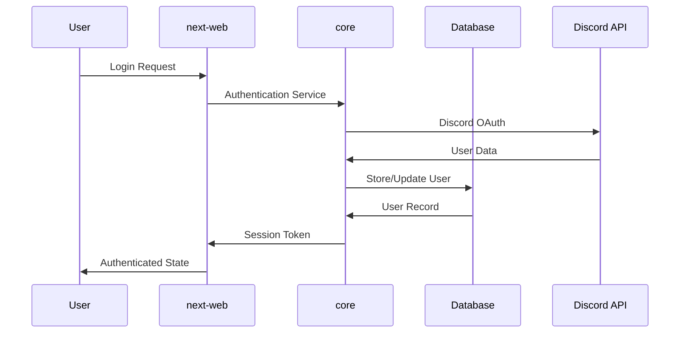
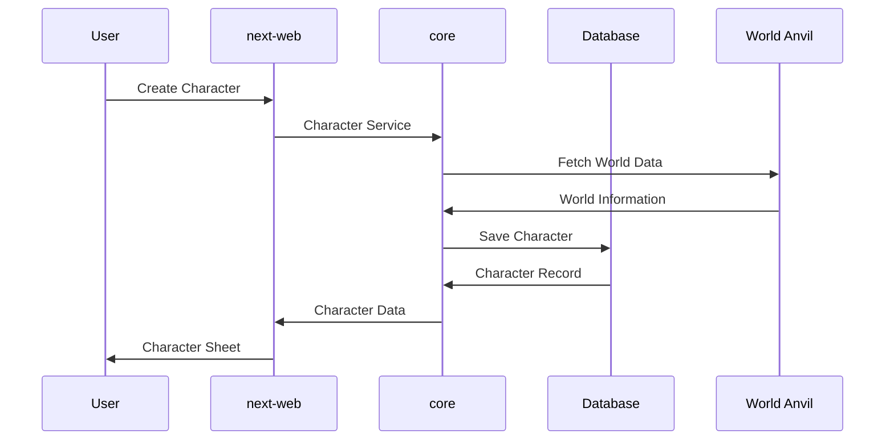
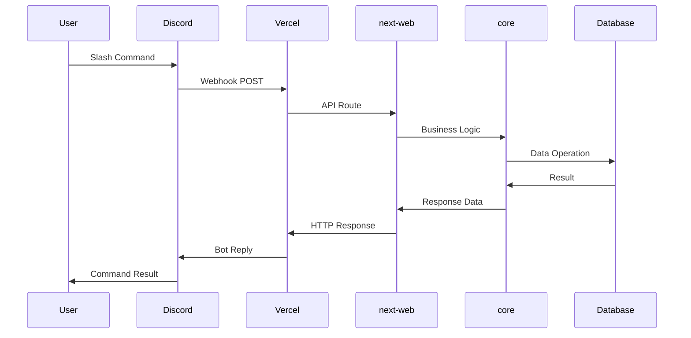

# Crit-Fumble Architecture Documentation

This document provides a comprehensive overview of the Crit-Fumble system architecture, explaining how all components work together to create a cohesive D&D gaming platform.

## 🎯 System Overview

Crit-Fumble is a comprehensive D&D gaming platform built as a TypeScript monorepo with multiple interconnected applications and services.

### Core Purpose
- **Character Management**: Create, manage, and share D&D characters
- **World Building**: Integration with World Anvil for rich world content
- **Community Features**: Discord bot for game management and community interaction
- **Web Platform**: Comprehensive web application for all features

## 🏗️ Architectural Principles

### 1. **Monorepo Organization**
- **Shared Foundation**: Common models and utilities in `@crit-fumble/core`
- **Package Isolation**: Clear boundaries between packages with enforced dependencies
- **Incremental Development**: Build and deploy packages independently
- **Code Reuse**: Maximize sharing while maintaining separation of concerns

### 2. **Dependency Direction**
```
Web Application (next-web) with Discord Webhooks
    ↓
UI Components (react)
    ↓
Business Logic (core)
    ↓
External Integrations (worldanvil)
```

### 3. **Technology Stack**
- **Language**: TypeScript for type safety and developer experience
- **Frontend**: Next.js + React for the web application
- **Backend**: Next.js API routes with Discord webhooks
- **Database**: PostgreSQL with Prisma ORM
- **External APIs**: World Anvil, OpenAI, Discord APIs
- **Hosting**: Vercel with built-in cron jobs

## 📦 Package Architecture

### @crit-fumble/worldanvil
**Role**: External API Integration Layer
```typescript
// Purpose: Clean interface to World Anvil API
interface WorldAnvilClient {
  authentication: AuthService;
  articles: ArticleService;
  characters: CharacterService;
  worlds: WorldService;
}

// Architecture Pattern
Client → Service → Model → External API
```

**Key Features**:
- Authentication management for World Anvil API
- Typed models for World Anvil data structures
- Error handling and retry logic
- Rate limiting and caching

### @crit-fumble/core
**Role**: Business Logic and Data Layer
```typescript
// Purpose: Central hub for all business logic
interface CorePackage {
  models: DatabaseModels & BusinessModels;
  services: BusinessServices;
  controllers: ApiControllers;
  utils: SharedUtilities;
  config: ConfigurationManagement;
}

// Architecture Pattern
Controller → Service → Model → Database/External API
```

**Key Components**:
- **Database Models**: Prisma-based data models for all entities
- **Business Services**: Game mechanics, character management, user authentication
- **API Controllers**: Request/response handling for web and bot applications
- **Configuration**: Environment-specific settings and feature flags
- **Utilities**: Shared helper functions and type definitions

### @crit-fumble/react
**Role**: UI Component Library
```typescript
// Purpose: Reusable React components and hooks
interface ReactPackage {
  components: UIComponents;
  hooks: CustomHooks;
  providers: ContextProviders;
  types: ComponentTypes;
}

// Architecture Pattern
Component → Hook → Core Service → API
```

**Key Features**:
- Framework-agnostic React components
- Custom hooks for common patterns
- Context providers for state management
- TypeScript-first component design

### @crit-fumble/next-web
**Role**: Full-Stack Web Application
```typescript
// Purpose: Complete web platform with Discord webhooks
interface NextWebPackage {
  pages: NextJSPages;
  api: {
    auth: AuthEndpoints;
    discord: DiscordWebhooks;
    cron: ScheduledTasks;
  };
  components: WebComponents;
  services: WebServices;
}

// Architecture Pattern
User → Next.js Route → Discord Webhook → Core Service → Database
```

**Key Features**:
- Server-side rendering with Next.js
- Discord webhook integration (no persistent bot needed)
- Vercel cron jobs for scheduled tasks
- Authentication and user management
- Integration with core services for data management

### @crit-fumble/next-web
**Role**: Web Application
```typescript
// Purpose: Main web application for users
interface NextWebApp {
  pages: AppPages;
  api: ApiRoutes;
  components: AppComponents;
  lib: AppUtilities;
}

// Architecture Pattern
Page → Component → Hook → API Route → Core Service
```

**Key Features**:
- Server-side rendering for performance
- API routes for web-specific functionality
- Authentication and session management
- Responsive design for all devices

## 🔄 Data Flow Patterns

### User Authentication Flow


### Character Creation Flow


### Discord Webhook Interaction Flow


## 🛠️ Development Architecture

### Build System
```
TypeScript Project References
    ↓
ESLint Workspace Rules
    ↓
Incremental Compilation
    ↓
Build Caching
    ↓
Package Publishing
```

### Development Environment
```
Developer Workspace
├── VS Code Configuration
├── DevContainer Setup
├── Hot Reload System
├── Debug Configurations
└── Testing Framework
```

### CI/CD Pipeline
```
Git Push
    ↓
GitHub Actions
    ↓
Lint & Test All Packages
    ↓
Build Optimization
    ↓
Deploy Applications
    ├── next-web → Vercel
    └── next-web → Vercel
```

## 🗄️ Data Architecture

### Database Schema
```typescript
// Core Entities
interface DatabaseSchema {
  users: UserTable;
  characters: CharacterTable;
  sheets: RpgSheetTable;
  sessions: GameSessionTable;
  worlds: WorldTable;
  articles: ArticleTable;
}

// Relationships
User (1) → (n) Character
Character (1) → (1) RpgSheet
User (n) → (n) GameSession
World (1) → (n) Article
```

### Data Flow Layers
```
1. Presentation Layer (React Components)
    ↓
2. Application Layer (Next.js API Routes / Discord Commands)
    ↓
3. Business Logic Layer (Core Services)
    ↓
4. Data Access Layer (Prisma ORM)
    ↓
5. Storage Layer (PostgreSQL Database)
```

## 🔐 Security Architecture

### Authentication Strategy
- **Discord OAuth2**: Primary authentication method
- **JWT Tokens**: Session management
- **Role-Based Access**: User permissions and capabilities

### API Security
- **Input Validation**: All data validated at entry points
- **Rate Limiting**: Prevent abuse of API endpoints
- **CORS Configuration**: Secure cross-origin requests
- **Environment Variables**: Sensitive configuration management

### Data Protection
- **Encryption**: Sensitive data encrypted at rest
- **Audit Logging**: Track important data changes
- **Backup Strategy**: Regular database backups
- **Privacy Controls**: User data management and deletion

## 🚀 Deployment Architecture

### Production Environment
```
Vercel (next-web)
├── Edge Functions
├── Serverless Functions
├── Static Site Generation
└── CDN Distribution

Fly.io (discord-bot)
├── Docker Container
├── Persistent Storage
├── Health Monitoring
└── Auto-scaling
```

### Infrastructure as Code
```yaml
# Vercel Configuration
vercel.json:
  - Build settings
  - Environment variables
  - Route configuration
  - Function settings

# Fly.io Configuration
fly.toml:
  - App configuration
  - Resource allocation
  - Health checks
  - Deployment settings
```

### Monitoring and Observability
- **Application Monitoring**: Error tracking and performance metrics
- **Infrastructure Monitoring**: Server health and resource usage
- **User Analytics**: Usage patterns and feature adoption
- **Alert Management**: Proactive issue detection and response

## 🔧 Configuration Management

### Environment Configuration
```typescript
interface EnvironmentConfig {
  development: DevConfig;
  staging: StagingConfig;
  production: ProductionConfig;
}

// Package-specific configuration
interface PackageConfig {
  database: DatabaseConfig;
  discord: DiscordConfig;
  worldanvil: WorldAnvilConfig;
  openai: OpenAIConfig;
}
```

### Feature Flags
```typescript
interface FeatureFlags {
  worldAnvilIntegration: boolean;
  aiCharacterGeneration: boolean;
  advancedDiceRoller: boolean;
  voiceChannelActivity: boolean;
}
```

## 📊 Performance Architecture

### Optimization Strategies
- **Build Optimization**: Incremental builds with intelligent caching
- **Bundle Optimization**: Code splitting and lazy loading
- **Database Optimization**: Query optimization and connection pooling
- **CDN Strategy**: Static asset distribution and caching

### Scalability Considerations
- **Horizontal Scaling**: Stateless application design
- **Database Scaling**: Read replicas and connection pooling
- **Caching Strategy**: Multi-layer caching (browser, CDN, application)
- **Microservice Readiness**: Package isolation enables future splitting

## 🧪 Testing Architecture

### Testing Strategy
```
Unit Tests (Jest)
    ↓
Integration Tests (Supertest)
    ↓
Component Tests (React Testing Library)
    ↓
End-to-End Tests (Playwright - Future)
```

### Quality Assurance
- **Type Safety**: TypeScript for compile-time error detection
- **Code Quality**: ESLint with custom rules for architectural compliance
- **Test Coverage**: Comprehensive test coverage for critical paths
- **Performance Testing**: Load testing for scalability validation

## 🔮 Future Architecture Considerations

### Planned Enhancements
- **Microservice Migration**: Gradual extraction of services
- **Real-time Features**: WebSocket integration for live features
- **Mobile Applications**: React Native packages for mobile apps
- **API Gateway**: Centralized API management and routing

### Scalability Roadmap
- **Database Sharding**: Horizontal database scaling
- **Event-Driven Architecture**: Asynchronous communication patterns
- **Container Orchestration**: Kubernetes for complex deployments
- **Global Distribution**: Multi-region deployment strategy

---

This architecture provides a solid foundation for the Crit-Fumble platform while maintaining flexibility for future growth and enhancement.