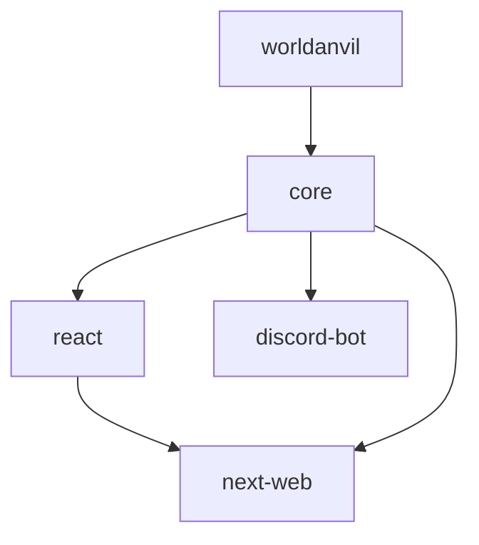

# Unified Build Process Documentation

This document describes how the @crit-fumble monorepo build system works, from development to production deployment.

## 🏗️ Architecture Overview

### Monorepo Structure
```
@crit-fumble/
├── packages/
│   ├── worldanvil/     # World Anvil API wrapper
│   ├── core/           # Shared models, services, utilities
│   ├── react/          # Framework-agnostic React components
│   ├── discord-bot/    # Discord bot application
│   └── next-web/       # Next.js web application
├── scripts/            # Build and development scripts
└── docs/              # Documentation
```

### Dependency Graph


**Build Order**: worldanvil → core → (react, discord-bot) → next-web

## 🔧 Build System Components

### 1. TypeScript Project References
- **Root coordination**: Main `tsconfig.json` orchestrates all packages
- **Package isolation**: Each package has its own TypeScript configuration
- **Dependency awareness**: Automatic build order based on references
- **Incremental compilation**: Only rebuilds changed packages

### 2. ESLint Workspace Configuration
- **Architectural enforcement**: Prevents improper cross-package imports
- **Package-specific rules**: Tailored linting for each package type
- **Workspace-level coordination**: Consistent code quality across all packages

### 3. Build Caching and Optimization
- **Content-based caching**: Git hash-based change detection
- **Incremental builds**: TypeScript `.tsbuildinfo` caching
- **Performance monitoring**: Build time tracking and optimization
- **Smart rebuilding**: Only affected packages are rebuilt

## 📋 Standard Development Workflow

### Initial Setup
```bash
# 1. Install dependencies
npm ci

# 2. Build all packages for the first time
npm run build:optimized

# 3. Verify everything works
npm test
npm run lint:all
```

### Daily Development
```bash
# Start development environment
npm run dev                 # Starts all development servers
npm run build:watch        # Watches for changes and rebuilds

# Work on specific packages
cd packages/core && npm run dev
cd packages/next-web && npm run dev
```

### Making Changes
```bash
# After making changes to any package
npm run build:optimized    # Smart incremental build
npm run lint               # Check code quality
npm test                   # Run tests

# If experiencing issues
npm run build:force        # Force rebuild everything
npm run clean:cache        # Clean and rebuild
```

### Before Committing
```bash
# Complete validation
npm run build:optimized    # Ensure everything builds
npm run lint:all          # Check all packages
npm test                  # Run all tests
```

## 🚀 Production Build Process

### CI/CD Pipeline
```yaml
# Recommended GitHub Actions workflow
name: Build and Deploy

on: [push, pull_request]

jobs:
  build:
    runs-on: ubuntu-latest
    steps:
      - uses: actions/checkout@v3
      
      - name: Setup Node.js
        uses: actions/setup-node@v3
        with:
          node-version: '18'
          cache: 'npm'
      
      - name: Install dependencies
        run: npm ci
      
      - name: Restore build cache
        uses: actions/cache@v3
        with:
          path: .build-cache
          key: build-cache-${{ hashFiles('packages/**/*') }}
      
      - name: Lint all packages
        run: npm run lint:all
      
      - name: Build all packages
        run: npm run build:optimized
      
      - name: Run tests
        run: npm test
      
      - name: Deploy applications
        run: |
          # Deploy next-web to Vercel
          cd packages/next-web && npm run build && npx vercel --prod
          
          # Deploy discord-bot to Fly.io
          cd packages/discord-bot && npm run build && fly deploy
```

### Package-Specific Builds

#### @crit-fumble/worldanvil
```bash
cd packages/worldanvil
npm run build              # TypeScript compilation
npm run test              # Jest tests
npm run lint              # ESLint validation
npm publish               # Publish to npm (if needed)
```

#### @crit-fumble/core
```bash
cd packages/core
npm run build              # TypeScript compilation
npm run test              # Jest tests
npm run lint              # ESLint validation
npm run db:migrate         # Prisma migrations
npm run db:generate        # Generate Prisma client
```

#### @crit-fumble/react
```bash
cd packages/react
npm run build              # TypeScript + React compilation
npm run test              # Jest + React Testing Library
npm run lint              # ESLint + React rules
npm run storybook         # Component documentation (future)
```

#### @crit-fumble/discord-bot
```bash
cd packages/discord-bot
npm run build              # TypeScript compilation
npm run test              # Jest tests
npm run lint              # ESLint validation
npm run deploy            # Deploy to Fly.io
```

#### @crit-fumble/next-web
```bash
cd packages/next-web
npm run build              # Next.js production build
npm run test              # Jest + React Testing Library
npm run lint              # Next.js ESLint + custom rules
npm run start             # Production server
```

## 🎯 Package Responsibilities

### @crit-fumble/worldanvil
- **Purpose**: World Anvil API integration wrapper
- **Exports**: API clients, models, and services for World Anvil
- **Dependencies**: None (external API wrapper)
- **Consumers**: core package

### @crit-fumble/core
- **Purpose**: Shared business logic, data models, and utilities
- **Exports**: Database models, services, utilities, configurations
- **Dependencies**: worldanvil package
- **Consumers**: react, discord-bot, next-web packages

### @crit-fumble/react
- **Purpose**: Framework-agnostic React components and hooks
- **Exports**: UI components, custom hooks, providers
- **Dependencies**: core package
- **Consumers**: next-web package, future React applications

### @crit-fumble/discord-bot
- **Purpose**: Discord bot application
- **Exports**: None (standalone application)
- **Dependencies**: core package
- **Deployment**: Fly.io instance

### @crit-fumble/next-web
- **Purpose**: Main web application
- **Exports**: None (standalone application)
- **Dependencies**: core, react packages
- **Deployment**: Vercel platform

## 🔄 Data Flow Architecture

### Development Data Flow
```
Developer Changes
    ↓
TypeScript Compilation (incremental)
    ↓
ESLint Validation (package-specific)
    ↓
Test Execution (Jest)
    ↓
Build Optimization (caching)
    ↓
Development Server Restart
```

### Production Data Flow
```
Git Push/PR
    ↓
CI/CD Trigger (GitHub Actions)
    ↓
Dependency Installation (npm ci)
    ↓
Cache Restoration (build cache)
    ↓
Lint All Packages (workspace-wide)
    ↓
Build All Packages (optimized)
    ↓
Test All Packages (comprehensive)
    ↓
Deploy Applications (Vercel + Fly.io)
```

### Runtime Data Flow
```
User Request
    ↓
Next.js Application (next-web)
    ↓
React Components (@crit-fumble/react)
    ↓
Business Logic (@crit-fumble/core)
    ↓
External APIs (@crit-fumble/worldanvil)
    ↓
Database (Prisma + PostgreSQL)
```

## 🛡️ Quality Assurance

### Code Quality Gates
1. **TypeScript Compilation**: All packages must compile without errors
2. **ESLint Validation**: All packages must pass architectural and style rules
3. **Test Coverage**: All packages must pass their test suites
4. **Build Optimization**: All packages must build efficiently with caching

### Architectural Boundaries
- **Core isolation**: Core package cannot import from applications
- **React purity**: React package only depends on core
- **Application independence**: Applications don't depend on each other
- **Wrapper independence**: worldanvil package has no internal dependencies

### Performance Standards
- **Build time**: Full build should complete in under 2 minutes
- **Incremental builds**: Changed packages should build in under 30 seconds
- **Cache efficiency**: 80%+ cache hit rate for unchanged packages
- **Bundle size**: Each package should maintain reasonable bundle sizes

## 🚨 Troubleshooting Common Issues

### Build Failures

**"Cannot find module" errors**
```bash
# Solution: Rebuild dependencies
npm run build:force
npm run build:optimized
```

**"Project references" errors**
```bash
# Solution: Check TypeScript configuration
npm run build:clean
npm run build:all
```

**"Cache corruption" warnings**
```bash
# Solution: Clear cache and rebuild
npm run clean:cache
npm run build:optimized
```

### Development Issues

**Hot reload not working**
```bash
# Solution: Restart development servers
npm run build:watch    # In terminal 1
npm run dev           # In terminal 2
```

**ESLint errors after refactoring**
```bash
# Solution: Run workspace-wide linting
npm run lint:all
```

**Type errors between packages**
```bash
# Solution: Rebuild all packages with fresh types
npm run build:force
```

### Production Issues

**Deployment failures**
```bash
# Verify production build locally
npm run build:optimized
cd packages/next-web && npm run build
cd packages/discord-bot && npm run build
```

**Runtime errors in production**
```bash
# Check build outputs
ls -la packages/*/dist/
npm run test  # Ensure tests pass
```

## 📈 Monitoring and Optimization

### Build Performance Metrics
- Track build times for each package
- Monitor cache hit rates
- Measure total CI/CD pipeline duration
- Analyze bundle sizes and dependencies

### Development Experience Metrics
- Time from change to hot reload
- Frequency of build failures
- Developer productivity indicators
- Error resolution time

### Production Health Metrics
- Application deployment success rate
- Runtime error rates
- Performance benchmarks
- User experience metrics

## 🔮 Future Enhancements

### Build System Improvements
- **Parallel package building** for independent packages
- **Distributed caching** for team development
- **Bundle analysis** and optimization tools
- **Automated dependency updates**

### Development Workflow Enhancements
- **Pre-commit hooks** for automated validation
- **Development container** support
- **Advanced debugging** tools and configurations
- **Performance profiling** integration

### CI/CD Pipeline Improvements
- **Matrix builds** for multiple environments
- **Automated security scanning**
- **Performance regression detection**
- **Automated documentation generation**

## 📚 Related Documentation

- [ESLint Configuration](./eslint-configuration.md) - Package-specific linting rules
- [TypeScript Project References](./typescript-project-references.md) - Build system details
- [Build Caching and Optimization](./build-caching-optimization.md) - Performance optimization
- [Architecture Documentation](./architecture.md) - System design and patterns

---

**Note**: This document represents the intended workflow. For current status and known issues, see the [todo.instructions.md](../.github/instructions/todo.instructions.md) file.